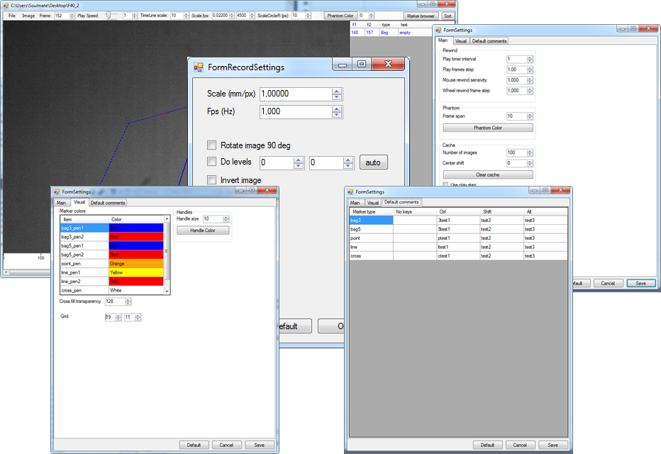

# BagFinder
View image sequences and add marking to it
Программа для разметки последовательности изображений.

[Детальное описание в docx файле](info/_description_rus.docx)
## Аргументы командной  строки
"J:\2017 03 Bags\records\1 вид сверху, холодная вода\04-05 F34_2" 11111 "100 100 200 300" - 
путь к папке, номер кадра, координаты углов начального зума
## Горячие клавиши
- 1-6 - выбор инструмента по созданию маркеров
-	левая кнопка мыши - создание и редактирование маркеров
-	shif + лкм - перейти к кадру элемента маркера
-	ctrl + alt + лкм - не цепляться за ручки, если нужно создать маркер, начинающийся прямо из ручки
-	правая кнопка мыши по узлу маркера или кнопка Del - удаление маркера
-	для area_brush: 
    -	[ и ] или Alt + Колесо мыши – изменение размера кисти.
    -	C – удалить всё
    -	Z – отменить 
-	z - зум с рамкой
-	Q + движение мыши вправо-влево - прокрутка вперед/назад.
-	Q + колесо мыши - меняет скорость этой прокрутки
-	P - показать положение курсора в пикселях
-	O - показать масштабный кружок возле курсора
-	esc - отменить создание маркера
-	Del - удалить выбранный маркер (?)
-	F11 - скрыть/показать все панели
-	F5-F8 - скрыть показать отдельные панели
-	ctrl + A - показать изображение в натуральный размер (1 к 1)
-	ctrl + F - подогнать размер изображения под размер окна
## Управление воспроизведением:
  -	A/D или ctrl + стрелка вправо/влево - запустить или остановить воспроизведение вперед/назад
  -	W/S или ctrl + стрелка вверх/вниз - изменить скорость просмотра
  -	пробел - запустить/остановить вперед
  -	ctrl + пробел - запустить/остановить назад
